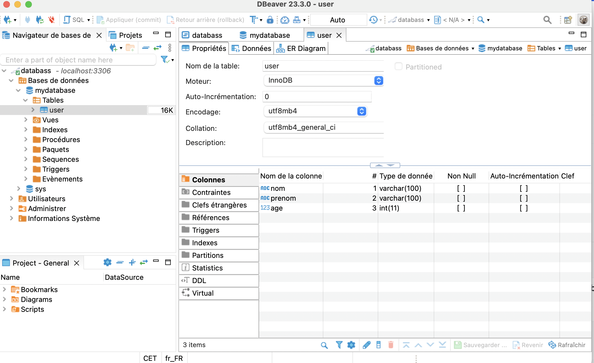
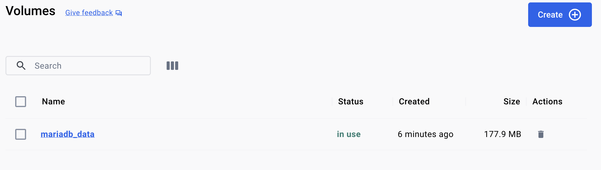

# BDD Persistante

## Créer une bdd sans volume

Récupérer l'image mariadbd

- docker pull mariadb

Vérifier l'image est bien installé

- docker images

Création de la bdd

- docker run --name database -e MYSQL_ROOT_PASSWORD=mypass -p 3306:3306 -d docker.io/library/mariadb

## Créer une bdd liée avec un volume

Récupérer l'image mariadbd

- docker pull mariadb

Vérifier l'image est bien installé

- docker images

Créer le volume

- docker volume create mariadb_data                                             

Créer la bdd liée avec le volume

- docker run --name mariadbtest -e MYSQL_ROOT_PASSWORD=mypass -p 3306:3306 -v mariadb_data:/var/lib/mysql -d mariadb:latest 

 

 

Si on ne se base pas sur un volume pour la création de notre bdd, lorsque nous allons supprimer notre conteneur, la base est supprimée pour désengager la base au conteneur, nous utilisons des volumes.

Le but de volume docker est sauvegarder des données et aussi les partager entre les conteneurs.

Dans application Stateless chaque requête du client au serveur est traitée comme une demande indépendante, sans conserver d'informations sur l'état de la session. 

Dans une application Stateful, l'état de chaque interaction utilisateur est enregistré et stocké côté serveur.

Les applications Stateful sont des application avec état et réagissent par l'état actuel, tandis que les applications Stateless sont des applications sans état qui agissent indépendamment sans prendre en compte les demandes précédentes / suivantes