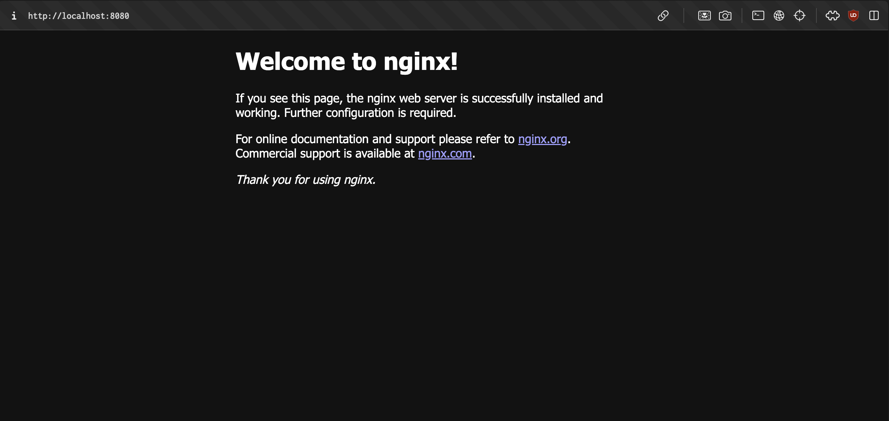

# Commandes de base

Lister les images docker en local :

- docker images

Lister les conteneurs en cours d'execution :

- docker ps

Lister tous les conteneurs en cours d'excution et arrêtés :

- docker ps -a

Lancer un conteneur depuis une image :

- docker run nom_image[:tag]

Démarrer un conteneur

- Docker star nom_conteneur

Arreter un conteneur en cours d'excution :

- docker stop nom_conteneur

Supprimer un conteneur arrêté :

- docker rm nom_conteneur

Supprimer une image

- docker rim nom_image[:tag]

Exécuter une commande à l'interieur d'un conteneur en cours d'exécution

- docker exec -it nom_conteneur commande

Chercher une image sur le hub

- docker search nom_image 

Récapitulatif des lignes de commandes utilisées pour lancer un conteneur avec l'image nginx :

- docker images

- docker pull nginx

- docker run -d -p 8080:80 nginx

- docker images

 
