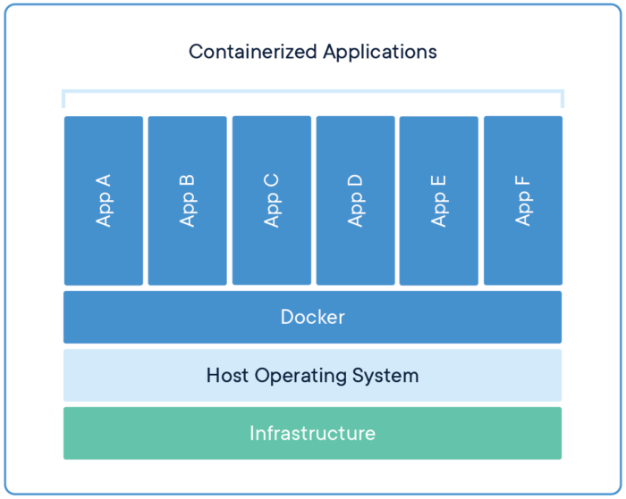

# DOCKER

Docker est une technologie permettant le deploiement d'application grâce à des conteneurs
Le conteneur regroupe l'application ou logiciel avec ses dependances.
Ce qui permet d'assurer un environnement de deploiement stable.

# AVANTAGES DE DOCKER

 - Gestion de dépendances
 - Plusieurs conteneurs avec différentes versions d'un logiciel peuvent être sur la même machine
 - N'importe quelles applications peut être conteneurisées
 - Intégration continue et automatisation du déploiement, test et livraison

 # DOCKER VS MV 

Sur le schéma ci-dessous, nous pouvons voir 6 applications sur 6 dockers différents. Les 6 applications sont indépendantes les unes des autres et peuvent avoir des versions différentes.
Un conteneur virtualise le système d'exploitation de la machine et permet une meilleur gestion de ressources. Alors que pour une machine virtuelle, il faut configurer la taille du disque, la puissance, la RAM...

 

Ci dessous, nous pouvons voir 3 machines virtuelles avec 3 applications différentes. Comparé au schema de docker, nous pouvons voir que chaque machines virtuelles à son propre système d'exploitation.

 

Quelques avantages :

- Optimisation des ressources de l'hôte
- Rapidité de démarrage
- Isolation des applications sur les différents dockers différents
- Légereté des conteneurs permet de lancer un grand nombre de conteneurs sur le même hôte
